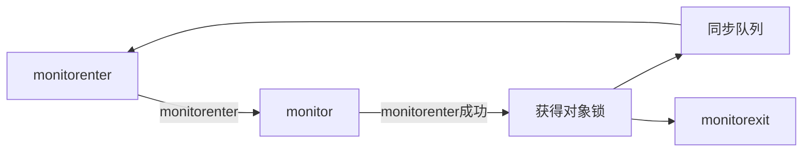
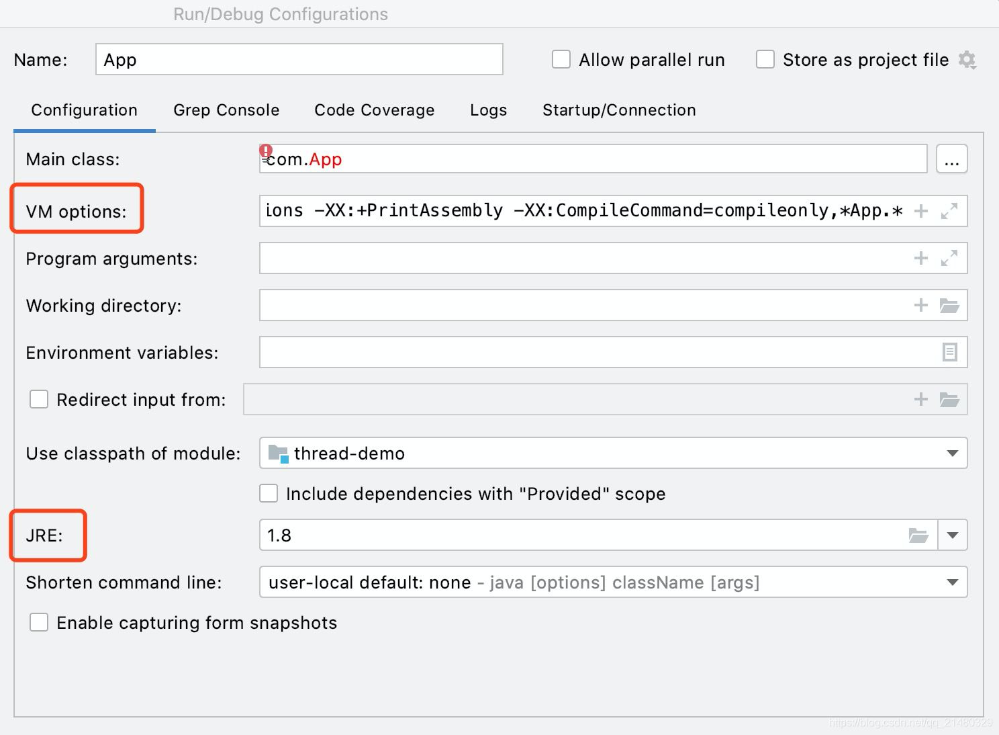
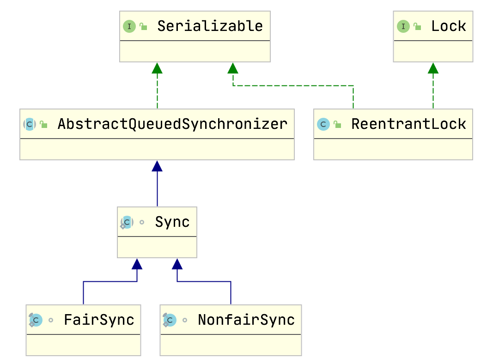
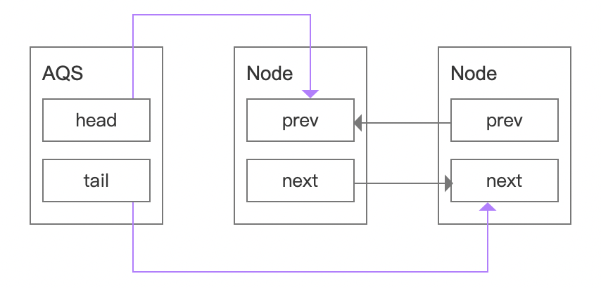
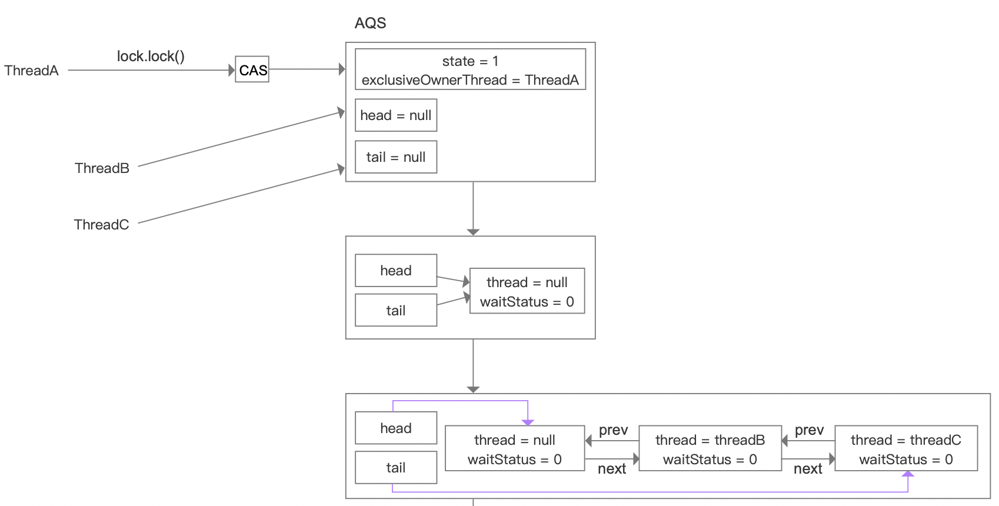
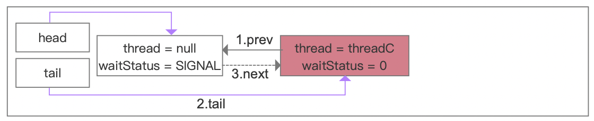
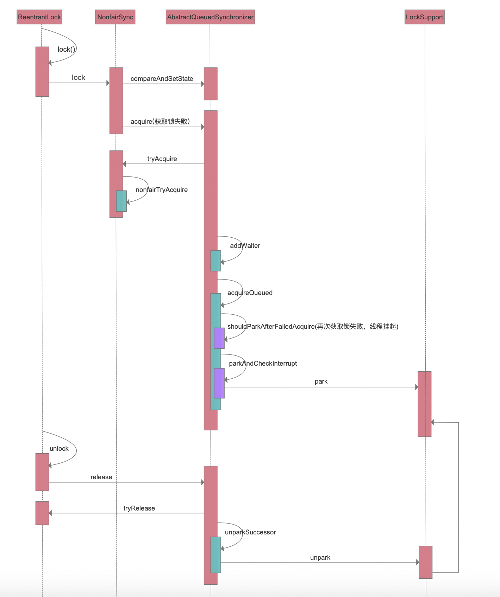
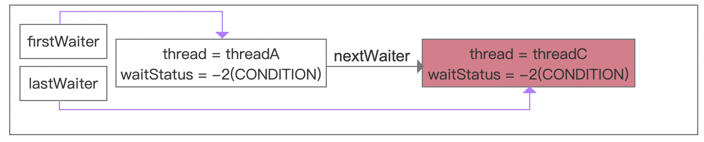
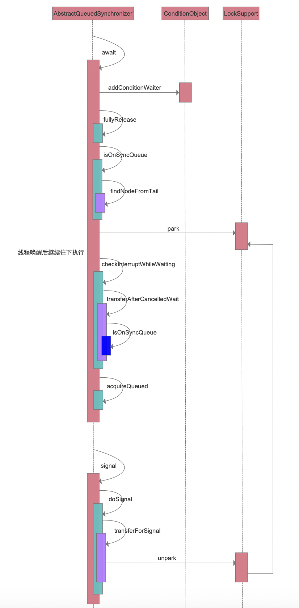

thread-source-study

# 一、对象内存布局

​		在 Hotspot 虚拟机中，对象在内存中的存储布局，可以分 为三个区域:对象头(Header)、实例数据(Instance Data)、对 齐填充(Padding)。

​		

​		对象头记录了对象和锁有关的信息，当某个对象被 synchronized 关键字当成同步锁时，那么围绕这个锁的一 系列操作都和 Mark word 有关系。Mark Word 在 32 位虚 拟机的长度是 32bit、在 64 位虚拟机的长度是 64bit。

<center>32位Mark Word的状态变化</center>

<table width="384.30" border="0" cellpadding="0" cellspacing="0" style='width:384.30pt;border-collapse:collapse;table-layout:fixed;'>
   <col width="151.20" span="2" class="xl65" style='mso-width-source:userset;mso-width-alt:2184;'/>
   <col width="197.45" class="xl65" style='mso-width-source:userset;mso-width-alt:4157;'/>
   <col width="169.95" class="xl65" style='mso-width-source:userset;mso-width-alt:2984;'/>
   <col width="163.30" class="xl65" style='mso-width-source:userset;mso-width-alt:2700;'/>
   <col width="151.20" span="16379" class="xl65" style='mso-width-source:userset;mso-width-alt:2184;'/>
   <tr height="19.10" style='height:19.10pt;mso-height-source:userset;mso-height-alt:382;'>
    <td class="xl66" height="38.20" width="51.20" rowspan="2" style='height:38.20pt;width:51.20pt;border-right:1.0pt solid #EEEEEE;border-bottom:1.5pt solid #DDDDDD;' x:str>锁状态</td>
    <td class="xl67" width="148.65" colspan="2" style='width:148.65pt;border-right:1.0pt solid #EEEEEE;border-bottom:1.5pt solid #DDDDDD;' x:str>25bit</td>
    <td class="xl67" width="69.95" rowspan="2" style='width:69.95pt;border-right:1.0pt solid #EEEEEE;border-bottom:1.5pt solid #DDDDDD;' x:str>4bit</td>
    <td class="xl67" width="63.30" style='width:63.30pt;' x:str>1bit</td>
    <td class="xl76" width="51.20" style='width:51.20pt;' x:str>2bit</td>
   </tr>
   <tr height="19.10" style='height:19.10pt;'>
    <td class="xl69" x:str>23bit</td>
    <td class="xl69" x:str>2bit</td>
    <td class="xl70" x:str>是否偏向锁</td>
    <td class="xl77" x:str>锁标志位</td>
   </tr>
   <tr height="19.10" style='height:19.10pt;'>
    <td class="xl71" height="19.10" style='height:19.10pt;' x:str>无锁</td>
    <td class="xl72" colspan="2" style='border-right:1.0pt solid #EEEEEE;border-bottom:1.0pt solid #DDDDDD;' x:str>对象的hashCode</td>
    <td class="xl74" x:str>对象分代年龄</td>
    <td class="xl74" x:num>0</td>
    <td class="xl78" x:str>01</td>
   </tr>
   <tr height="18.35" style='height:18.35pt;'>
    <td class="xl75" height="18.35" style='height:18.35pt;' x:str>偏向锁</td>
    <td class="xl74" x:str>线程ID</td>
    <td class="xl74" x:str>Epoch</td>
    <td class="xl74" x:str>对象分代年龄</td>
    <td class="xl74" x:num>1</td>
    <td class="xl79" x:str>01</td>
   </tr>
   <tr height="20.60" style='height:20.60pt;mso-height-source:userset;mso-height-alt:412;'>
    <td class="xl75" height="20.60" style='height:20.60pt;' x:str>轻量级锁</td>
    <td class="xl72" colspan="4" style='border-right:1.0pt solid #EEEEEE;border-bottom:1.0pt solid #DDDDDD;' x:str>指向栈中锁记录的指针</td>
    <td class="xl78" x:str>00</td>
   </tr>
   <tr height="19.10" style='height:19.10pt;mso-height-source:userset;mso-height-alt:382;'>
    <td class="xl75" height="19.10" style='height:19.10pt;' x:str>重量级锁</td>
    <td class="xl74" colspan="4" style='border-right:1.0pt solid #EEEEEE;border-bottom:1.0pt solid #DDDDDD;' x:str>指向互斥量(重量级锁)的指针</td>
    <td class="xl79" x:num>10</td>
   </tr>
   <tr height="19.10" style='height:19.10pt;mso-height-source:userset;mso-height-alt:382;'>
    <td class="xl75" height="19.10" style='height:19.10pt;' x:str>GC标记</td>
    <td class="xl72" colspan="4" style='border-right:1.0pt solid #EEEEEE;border-bottom:1.0pt solid #DDDDDD;' x:str>空</td>
    <td class="xl78" x:num>11</td>
   </tr>
  </table>


<center>64位Mark Word的状态变化</center>

 <table width="384.30" border="0" cellpadding="0" cellspacing="0" style='width:579.20pt;border-collapse:collapse;table-layout:fixed;'>
   <col width="151.20" span="2" class="xl65" style='mso-width-source:userset;mso-width-alt:2184;'/>
   <col width="197.45" span="3" class="xl65" style='mso-width-source:userset;mso-width-alt:4157;'/>
   <col width="169.95" class="xl65" style='mso-width-source:userset;mso-width-alt:2984;'/>
   <col width="163.30" class="xl65" style='mso-width-source:userset;mso-width-alt:2700;'/>
   <col width="151.20" span="16377" class="xl65" style='mso-width-source:userset;mso-width-alt:2184;'/>
   <tr height="119.10" class="xl65" style='height:19.10pt;mso-height-source:userset;mso-height-alt:382;'>
    <td class="xl66" height="38.20" width="51.20" rowspan="2" style='height:38.20pt;width:51.20pt;border-right:1.0pt solid #EEEEEE;border-bottom:1.5pt solid #DDDDDD;' x:str>锁状态</td>
    <td class="xl67" width="51.20" rowspan="2" style='width:51.20pt;border-right:1.0pt solid #EEEEEE;border-bottom:none;' x:str>25bit</td>
    <td class="xl67" width="60.45" rowspan="2" style='width:97.45pt;border-right:1.0pt solid #EEEEEE;border-bottom:none;' x:str>29bit</td>
    <td class="xl67" width="60.45" rowspan="2" style='width:97.45pt;border-right:1.0pt solid #EEEEEE;border-bottom:none;' x:str>2bit</td>
    <td class="xl67" width="60.45" rowspan="2" style='width:97.45pt;border-right:1.0pt solid #EEEEEE;border-bottom:none;' x:str>1bit</td>
    <td class="xl74" width="60.95" rowspan="2" style='width:69.95pt;border-right:1.0pt solid #EEEEEE;border-bottom:1.5pt solid #DDDDDD;' x:str>4bit</td>
    <td class="xl74" width="60.30" style='width:63.30pt;' x:str>1bit</td>
    <td class="xl75" width="50.20" style='width:51.20pt;' x:str>2bit</td>
   </tr>
   <tr height="19.10" class="xl65" style='height:19.10pt;'>
    <td class="xl76" x:str>是否偏向锁</td>
    <td class="xl77" x:str>锁标志位</td>
   </tr>
   <tr height="19.10" class="xl65" style='height:19.10pt;'>
    <td class="xl69" height="19.10" style='height:19.10pt;' x:str>无锁</td>
    <td class="xl70" x:str>unused</td>
    <td class="xl71" colspan="2" style='border-right:1.0pt solid #EEEEEE;border-bottom:1.0pt solid #DDDDDD;' x:str>hashCode</td>
    <td class="xl70" x:str>unused</td>
    <td class="xl73" x:str>对象分代年龄</td>
    <td class="xl73" x:num>0</td>
    <td class="xl78" x:str>01</td>
   </tr>
   <tr height="18.35" class="xl65" style='height:18.35pt;'>
    <td class="xl72" height="18.35" style='height:18.35pt;' x:str>偏向锁</td>
    <td class="xl71" colspan="2" style='border-right:1.0pt solid #EEEEEE;border-bottom:1.0pt solid #DDDDDD;' x:str>线程ID</td>
    <td class="xl73" x:str>Epoch</td>
    <td class="xl73" x:str>unused</td>
    <td class="xl73" x:str>对象分代年龄</td>
    <td class="xl73" x:num>1</td>
    <td class="xl79" x:str>01</td>
   </tr>
   <tr height="20.60" class="xl65" style='height:20.60pt;mso-height-source:userset;mso-height-alt:412;'>
    <td class="xl72" height="20.60" style='height:20.60pt;' x:str>轻量级锁</td>
    <td class="xl71" colspan="6" style='border-right:1.0pt solid #EEEEEE;border-bottom:1.0pt solid #DDDDDD;' x:str>指向栈中锁记录的指针</td>
    <td class="xl78" x:str>00</td>
   </tr>
   <tr height="19.10" class="xl65" style='height:19.10pt;mso-height-source:userset;mso-height-alt:382;'>
    <td class="xl72" height="19.10" style='height:19.10pt;' x:str>重量级锁</td>
    <td class="xl73" colspan="6" style='border-right:1.0pt solid #EEEEEE;border-bottom:1.0pt solid #DDDDDD;' x:str>指向互斥量(重量级锁)的指针</td>
    <td class="xl79" x:num>10</td>
   </tr>
   <tr height="19.10" class="xl65" style='height:19.10pt;mso-height-source:userset;mso-height-alt:382;'>
    <td class="xl72" height="19.10" style='height:19.10pt;' x:str>GC标记</td>
    <td class="xl71" colspan="6" style='border-right:1.0pt solid #EEEEEE;border-bottom:1.0pt solid #DDDDDD;' x:str>空</td>
    <td class="xl78" x:num>11</td>
   </tr>
  </table>


**偏向锁**

偏向锁，顾名思义，它会偏向于第一个访问锁的线程，如果在运行过程中，同步锁只有一个线程访问，不存在多线程争用的情况，则线程是不需要触发同步的，这种情况下，就会给线程加一个偏向锁。 如果在运行过程中，遇到了其他线程抢占锁，则持有偏向锁的线程会被挂起，JVM会消除它身上的偏向锁，将锁恢复到标准的轻量级锁。

当线程1第一次访问临界区时，线程ID并未指向当前线程，则通过CAS操作竞争锁。如果竞争成功，则将Mark Word中线程ID设置为当前线程ID，然后执行同步代码块。

当线程1再次访问临界区时，如果为可偏向状态，线程ID是否指向当前线程，如果是，执行同步代码块。

实际上只有 Thread#1 初次进入临界区时需要执行 CAS 操作，以后再出入临界区都不会有同步操作带来的开销。

注意：偏向锁的场景太过于理想化，大多数情况都会关闭偏向锁。

**轻量级锁**

多个线程正常交替执行，当其中一个线程尝试进入临界区， 如果 Thread#2 也进入临界区但是 Thread#1 还没有执行完同步代码块时，会暂停 Thread#1 并且升级到轻量级锁。Thread#2 通过自旋再次尝试以轻量级锁的方式来获取锁。

自旋就是一定条件下的不断循环，目的是为了减少线程切换系统开销。

**重量级锁**

当多个线程同时进入临界区时，轻量级锁就会膨胀为重量级锁，及只有或得锁的线程执行同步代码块，其他线程都会被阻塞。如果 Thread#1 和 Thread#2 正常交替执行，那么轻量级锁基本能够满足锁的需求。但是如果 Thread#1 和 Thread#2 同时进入临界区，那么轻量级锁就会膨胀为重量级锁，意味着Thread#1线程获得了重量级锁的情况下，Thread#2就会被阻塞。

重量级锁的monitor

加了同步代码块以后，在字节码中会看到一个 monitorenter 和 monitorexit。
 每一个 JAVA 对象都会与一个监视器 monitor 关联，我们 可以把它理解成为一把锁，当一个线程想要执行一段被 synchronized 修饰的同步方法或者代码块时，该线程得先 获取到 synchronized 修饰的对象对应的 monitor。 monitorenter 表示去获得一个对象监视器。monitorexit 表 示释放 monitor 监视器的所有权，使得其他被阻塞的线程 可以尝试去获得这个监视器

monitor 依赖操作系统的 MutexLock(互斥锁)来实现的, 线 程被阻塞后便进入内核(Linux)调度状态，这个会导致系 统在用户态与内核态之间来回切换，严重影响锁的性能

通过javap -v xxx.class工具查看生成的class文件信息,分析synchronized关键字的实现细节

```html
public void demo(){
  synchronized (this){ //同步代码块

  }
}

javap -v Demo.class
  //同步代码块方法
  public void demo();
    descriptor: ()V
    flags: (0x0001) ACC_PUBLIC
    Code:
      stack=2, locals=3, args_size=1
         0: aload_0
         1: dup
         2: astore_1
         3: monitorenter   //重点
         4: aload_1
         5: monitorexit    //重点
         6: goto          14
         9: astore_2
        10: aload_1
        11: monitorexit   //重点
        12: aload_2
        13: athrow
        14: return
      Exception table:
         from    to  target type
             4     6     9   any
             9    12     9   any
      LineNumberTable:
        line 18: 0
        line 20: 4
        line 21: 14
      LocalVariableTable:
        Start  Length  Slot  Name   Signature
            0      15     0  this   Lcom/gupaoedu/vip/SyncDemo;
      StackMapTable: number_of_entries = 2
        frame_type = 255 /* full_frame */
          offset_delta = 9
          locals = [ class com/gupaoedu/vip/SyncDemo, class java/lang/Object ]
          stack = [ class java/lang/Throwable ]
        frame_type = 250 /* chop */
          offset_delta = 4
        
```

在 Hotspot 中，markOop的定义在markOop.hpp文件中，部分源码如下:

```java
//获取对象监视器  
bool has_monitor() const {
  return ((value() & monitor_value) != 0);
}

//ObjectMonitor是实现重量级锁核心
ObjectMonitor* monitor() const {
  assert(has_monitor(), "check");
  // Use xor instead of &~ to provide one extra tag-bit check.
  return (ObjectMonitor*) (value() ^ monitor_value);
}
```

重量级锁实现过程



总结

在所有的锁都启用的情况下线程进入临界区时会先去获取偏向锁，如果已经存在偏向锁了，则会尝试获取轻量级锁，启用自旋锁，如果自旋也没有获取到锁，则使用重量级锁，没有获取到锁的线程阻塞挂起，直到持有锁的线程执行完同步块唤醒他们；

偏向锁是在无锁争用的情况下使用的，也就是同步开在当前线程没有执行完之前，没有其它线程会执行该同步块，一旦有了第二个线程的争用，偏向锁就会升级为轻量级锁，如果轻量级锁自旋到达阈值后，没有获取到锁，就会升级为重量级锁；

如果线程争用激烈，那么应该禁用偏向锁。


轻量级锁及膨胀流程		

自旋必须要有一定的条件控制，否则如果一个线程执行同步代码块的时间很长，那么这个线程不断的循环反而会消耗CPU资源。默认情况下自旋的次数是10次， 可以通过 preBlockSpin 来修改 。

在 JDK1.6 之后，引入了自适应自旋锁，自适应意味着自旋 的次数不是固定不变的，而是根据前一次在同一个锁上自 旋的时间以及锁的拥有者的状态来决定。 如果在同一个锁对象上，自旋等待刚刚成功获得过锁，并 且持有锁的线程正在运行中，那么虚拟机就会认为这次自 旋也是很有可能再次成功，进而它将允许自旋等待持续相 对更长的时间。如果对于某个锁，自旋很少成功获得过， 那在以后尝试获取这个锁时将可能省略掉自旋过程，直接 阻塞线程，避免浪费处理器资源。


## 二、**Volatile**

​		volatile是一个特征[修饰符](https://baike.baidu.com/item/修饰符)（type specifier）.**volatile**的作用是作为指令[关键字](https://baike.baidu.com/item/关键字/7105697)，确保本条指令不会因[编译器](https://baike.baidu.com/item/编译器/8853067)的优化而省略，且要求每次直接读值。

​		看下面一个Demo,变量stop在未加关键volatile时，程序一直处于执行状态。当加了关键字volatile时，休眠1秒后退出程序。

```java
public class App {

    public volatile static boolean stop=false;

    public static void main( String[] args ) throws InterruptedException {
        Thread t1=new Thread(()->{
            int i=0;
            while(!stop){ //condition 不满足
                i++;
            }
        });
        t1.start();
        Thread.sleep(1000);
        stop=true; //true
    }
}
```

使用工具查看汇编代码，发现加上关键字volatile时，多了一个lock的指令

```java
//汇编代码
Java HotSpot(TM) 64-Bit Server VM warning: PrintAssembly is enabled; turning on DebugNonSafepoints to gain additional output
CompilerOracle: compileonly *App.*
Loaded disassembler from /Library/Java/JavaVirtualMachines/jdk1.8.0_261.jdk/Contents/Home/jre/lib/hsdis-amd64.dylib
Decoding compiled method 0x000000010abd7e10:
Code:
[Disassembling for mach='i386:x86-64']
[Entry Point]
[Verified Entry Point]
[Constants]
  # {method} {0x0000000108e7ad70} '<clinit>' '()V' in 'com/java/study/App'
  #           [sp+0x40]  (sp of caller)
  0x000000010abd7f80: mov    %eax,-0x14000(%rsp)
  0x000000010abd7f87: push   %rbp
  0x000000010abd7f88: sub    $0x30,%rsp
  0x000000010abd7f8c: movabs $0x108e7b028,%rsi  ;   {metadata(method data for {method} {0x0000000108e7ad70} '<clinit>' '()V' in 'com/java/study/App')}
  0x000000010abd7f96: mov    0xdc(%rsi),%edi
  0x000000010abd7f9c: add    $0x8,%edi
  0x000000010abd7f9f: mov    %edi,0xdc(%rsi)
  0x000000010abd7fa5: movabs $0x108e7ad70,%rsi  ;   {metadata({method} {0x0000000108e7ad70} '<clinit>' '()V' in 'com/java/study/App')}
  0x000000010abd7faf: and    $0x0,%edi
  0x000000010abd7fb2: cmp    $0x0,%edi
  0x000000010abd7fb5: je     0x000000010abd7fe4  ;*iconst_0
                                                ; - com.java.study.App::<clinit>@0 (line 9)

  0x000000010abd7fbb: nopl   0x0(%rax,%rax,1)
  0x000000010abd7fc0: jmpq   0x000000010abd8055  ;   {no_reloc}
  0x000000010abd7fc5: add    %al,(%rax)
  0x000000010abd7fc7: add    %al,(%rax)
  0x000000010abd7fc9: add    %bh,0x0(%rdi)
  0x000000010abd7fcf: mov    %dil,0x68(%rsi)
  0x000000010abd7fd3: lock addl $0x0,(%rsp)     ;*putstatic stop   //重点
                                                ; - com.java.study.App::<clinit>@1 (line 9)

  0x000000010abd7fd8: add    $0x30,%rsp
  0x000000010abd7fdc: pop    %rbp
  0x000000010abd7fdd: test   %eax,-0x7774ee3(%rip)        # 0x0000000103463100
                                                ;   {poll_return}
```

使用【hsdis】这个工具，来查看前面演示的这段代码的汇编指令，具体的使用请查看使用说明文档,在运行的代码中，设置 jvm 参数如下

```java
-server -Xcomp -XX:+UnlockDiagnosticVMOptions -XX:+PrintAssembly -XX:CompileCommand=compileonly,*App.*
```



然后在输出的结果中，查找下 lock 指令，会发现，在修改 带有 volatile 修饰的成员变量时，会多一个 lock 指令。lock 是一种控制指令，在多处理器环境下，lock 汇编指令可以 基于总线锁或者缓存锁的机制来达到可见性的一个效果。

注意：

mac os系统，需要把hsdis-amd64.dylib文件复制到{JAVV_HOME}/jre/lib目录下，其他系统参考相关文档。

**内存屏障**

解决缓存不一致性问题，cpu层面提供了指令，内存屏障。

CPU 层面的内存屏障

什么是内存屏障?从前面的内容基本能有一个初步的猜想， 内存屏障就是将 store bufferes 中的指令写入到内存，从 而使得其他访问同一共享内存的线程的可见性。
 X86 的 memory barrier 指令包括 lfence(读屏障) sfence(写 屏障) mfence(全屏障)。

Store Memory Barrier(写屏障) 告诉处理器在写屏障之前 的所有已经存储在存储缓存(store bufferes)中的数据同步 到主内存，简单来说就是使得写屏障之前的指令的结果对 屏障之后的读或者写是可见的。

Load Memory Barrier(读屏障) 处理器在读屏障之后的读 操作,都在读屏障之后执行。配合写屏障，使得写屏障之前 的内存更新对于读屏障之后的读操作是可见的。
Full Memory Barrier(全屏障) 确保屏障前的内存读写操作 的结果提交到内存之后，再执行屏障后的读写操作。

编译后的lock指令相当于加了缓存锁，及

Volatile -> 缓存锁 -> 内存屏障 -> 可见性

**JMM内存模型**

可见性问题的根本原因是高速缓存、重排序。 而 JMM 实际上就是提供了合理的禁用缓存以及禁止重排序的方法。所以它最核心的价值在于解决可见性和有序性。JMM 属于语言级别的抽象内存模型，可以简单理解为对硬件模型的抽象，它定义了共享内存中多线程程序读写操作的行为规范:在虚拟机中把共享变量存储到内存以及从内存中取出共享变量的底层实现细节。

编译器级别(语言级别内存屏障)/cpu层面(内存屏障)

```java
inline void OrderAccess::loadload()   { acquire(); }
inline void OrderAccess::storestore() { release(); }
inline void OrderAccess::loadstore()  { acquire(); }
inline void OrderAccess::storeload()  { fence(); }
```


## 三、AQS同步队列

**Lock 简介**

​		在 Lock 接口出现之前，Java 中的应用程序对于多线程的并发安全处理只能基于 synchronized 关键字来解决。但是 synchronized 在有些场景中会存在一些短板， 也就是它并不适合于所有的并发场景。但是在 Java5 以后，Lock 的出现可以解决 synchronized 在某些场景中的短板，它比 synchronized 更加灵活。

**Lock 的实现**

​		Lock 本质上是一个接口，它定义了释放锁和获得锁的抽象方法，定义成接口就意味着它定义了锁的一个标准规范，也同时意味着锁的不同实现。实现 Lock 接口的类有很多，以下为几个常见的锁实现 ReentrantLock:表示重入锁，它是唯一一个实现了 Lock 接口的类。重入锁指的是 线程在获得锁之后，再次获取该锁不需要阻塞，而是直接关联一次计数器增加重入 次数
​		ReentrantReadWriteLock:重入读写锁，它实现了 ReadWriteLock 接口，在这个 类中维护了两个锁，一个是 ReadLock，一个是WriteLock，他们都分别实现了 Lock 接口。读写锁是一种适合读多写少的场景下解决线程安全问题的工具，基本原则是: 读和读不互斥、读和写互斥、写和写互斥。也就是说涉及到影响数据变化的操作都会存在互斥。
 		StampedLock: stampedLock是 JDK8 引入的新的锁机制，可以简单认为是读写锁的一个改进版本，读写锁虽然通过分离读和写的功能使得读和读之间可以完全并发，但是读和写是有冲突的，如果大量的读线程存在，可能会引起写线程的饥饿。 stampedLock 是一种乐观的读策略，使得乐观锁完全不会阻塞写线程。

Lock 的类关系图

Lock 有很多的锁的实现，但是直观的实现是ReentrantLock重入锁



**Lock应用**

```java
static Lock lock=new ReentrantLock();
lock.lock(); //获得一个锁
lock.unlock();// 释放锁

//读写锁
static ReentrantReadWriteLock wrl=new ReentrantReadWriteLock();
static Lock read=wrl.readLock();
static Lock write=wrl.writeLock();

//获得读锁->当有线程获取到写锁在更新数据时，阻塞
read.lock(); 
read.unlock();

//获得了写锁
write.lock();
write.unlock();
```

**ReentrantLock的实现原理**

当线程竞争锁失败时，进入AQS同步队列，等待唤醒，再次竞争锁。同步队列 AQS，全称 AbstractQueuedSynchronizer，它是一个同步工具也是 Lock 用来实现线程同步的核心组件。

AQS 的功能分为两种:独占和共享独占锁，每次只能有一个线程持有锁。

 ReentrantLock就是以独占方式实现的互斥锁 。

共享锁，允许多个线程同时获取锁，并发访问共享资源，如 ReentrantReadWriteLock。

AQS 的内部实现

AQS 队列内部维护的是一个 FIFO 的双向链表，这种结构的特点是每个数据结构都有两个指针，分别指向直接的后继节点和直接前驱节点。所以双向链表可以从任 意一个节点开始很方便的访问前驱和后继。每个 Node 其实是由线程封装，当线程争抢锁失败后会封装成 Node 加入到 ASQ 队列中去;当获取锁的线程释放锁以后，会从队列中唤醒一个阻塞的节点(线程)。

AQS同步队列示意如下所示



注意: queue阻塞队列不包含 head。

Node节点源码

```java
static final class Node {
        /** Marker to indicate a node is waiting in shared mode */
        static final Node SHARED = new Node();
        /** Marker to indicate a node is waiting in exclusive mode */
        static final Node EXCLUSIVE = null;

        /** waitStatus value to indicate thread has cancelled. */
        static final int CANCELLED =  1;
        /** waitStatus value to indicate successor's thread needs unparking. */
        static final int SIGNAL    = -1;
        /** waitStatus value to indicate thread is waiting on condition. */
        static final int CONDITION = -2;
        /**
         * waitStatus value to indicate the next acquireShared should
         * unconditionally propagate.
         */
        static final int PROPAGATE = -3;

        /**
         * Status field, taking on only the values:
         *   SIGNAL:     The successor of this node is (or will soon be)
         *               blocked (via park), so the current node must
         *               unpark its successor when it releases or
         *               cancels. To avoid races, acquire methods must
         *               first indicate they need a signal,
         *               then retry the atomic acquire, and then,
         *               on failure, block.
         *   CANCELLED:  This node is cancelled due to timeout or interrupt.
         *               Nodes never leave this state. In particular,
         *               a thread with cancelled node never again blocks.
         *   CONDITION:  This node is currently on a condition queue.
         *               It will not be used as a sync queue node
         *               until transferred, at which time the status
         *               will be set to 0. (Use of this value here has
         *               nothing to do with the other uses of the
         *               field, but simplifies mechanics.)
         *   PROPAGATE:  A releaseShared should be propagated to other
         *               nodes. This is set (for head node only) in
         *               doReleaseShared to ensure propagation
         *               continues, even if other operations have
         *               since intervened.
         *   0:          None of the above
         *
         * The values are arranged numerically to simplify use.
         * Non-negative values mean that a node doesn't need to
         * signal. So, most code doesn't need to check for particular
         * values, just for sign.
         *
         * The field is initialized to 0 for normal sync nodes, and
         * CONDITION for condition nodes.  It is modified using CAS
         * (or when possible, unconditional volatile writes).
         */
        volatile int waitStatus;

        /**
         * Link to predecessor node that current node/thread relies on
         * for checking waitStatus. Assigned during enqueuing, and nulled
         * out (for sake of GC) only upon dequeuing.  Also, upon
         * cancellation of a predecessor, we short-circuit while
         * finding a non-cancelled one, which will always exist
         * because the head node is never cancelled: A node becomes
         * head only as a result of successful acquire. A
         * cancelled thread never succeeds in acquiring, and a thread only
         * cancels itself, not any other node.
         */
        volatile Node prev;

        /**
         * Link to the successor node that the current node/thread
         * unparks upon release. Assigned during enqueuing, adjusted
         * when bypassing cancelled predecessors, and nulled out (for
         * sake of GC) when dequeued.  The enq operation does not
         * assign next field of a predecessor until after attachment,
         * so seeing a null next field does not necessarily mean that
         * node is at end of queue. However, if a next field appears
         * to be null, we can scan prev's from the tail to
         * double-check.  The next field of cancelled nodes is set to
         * point to the node itself instead of null, to make life
         * easier for isOnSyncQueue.
         */
        volatile Node next;

        /**
         * The thread that enqueued this node.  Initialized on
         * construction and nulled out after use.
         */
        volatile Thread thread;

        /**
         * Link to next node waiting on condition, or the special
         * value SHARED.  Because condition queues are accessed only
         * when holding in exclusive mode, we just need a simple
         * linked queue to hold nodes while they are waiting on
         * conditions. They are then transferred to the queue to
         * re-acquire. And because conditions can only be exclusive,
         * we save a field by using special value to indicate shared
         * mode.
         */
        Node nextWaiter;

        /**
         * Returns true if node is waiting in shared mode.
         */
        final boolean isShared() {
            return nextWaiter == SHARED;
        }

        /**
         * Returns previous node, or throws NullPointerException if null.
         * Use when predecessor cannot be null.  The null check could
         * be elided, but is present to help the VM.
         *
         * @return the predecessor of this node
         */
        final Node predecessor() {
            Node p = prev;
            if (p == null)
                throw new NullPointerException();
            else
                return p;
        }

        /** Establishes initial head or SHARED marker. */
        Node() {}

        /** Constructor used by addWaiter. */
        Node(Node nextWaiter) {
            this.nextWaiter = nextWaiter;
            THREAD.set(this, Thread.currentThread());
        }

        /** Constructor used by addConditionWaiter. */
        Node(int waitStatus) {
            WAITSTATUS.set(this, waitStatus);
            THREAD.set(this, Thread.currentThread());
        }

        /** CASes waitStatus field. */
        final boolean compareAndSetWaitStatus(int expect, int update) {
            return WAITSTATUS.compareAndSet(this, expect, update);
        }

        /** CASes next field. */
        final boolean compareAndSetNext(Node expect, Node update) {
            return NEXT.compareAndSet(this, expect, update);
        }

        final void setPrevRelaxed(Node p) {
            PREV.set(this, p);
        }

        // VarHandle mechanics
        private static final VarHandle NEXT;
        private static final VarHandle PREV;
        private static final VarHandle THREAD;
        private static final VarHandle WAITSTATUS;
        static {
            try {
                MethodHandles.Lookup l = MethodHandles.lookup();
                NEXT = l.findVarHandle(Node.class, "next", Node.class);
                PREV = l.findVarHandle(Node.class, "prev", Node.class);
                THREAD = l.findVarHandle(Node.class, "thread", Thread.class);
                WAITSTATUS = l.findVarHandle(Node.class, "waitStatus", int.class);
            } catch (ReflectiveOperationException e) {
                throw new ExceptionInInitializerError(e);
            }
        }
    }
```

```java
//进入ReentrantLock类public void lock()方法，ReentrantLock#lock()
static Lock lock=new ReentrantLock();
lock.lock(); //获得一个锁

//进入ReentrantLock内部类NonfairSync类final void lock()方法，NonfairSync#lock()
sync.lock();
NonfairSync#lock()源码
final void lock() {
  //cas原子操作
  if (compareAndSetState(0, 1))
    setExclusiveOwnerThread(Thread.currentThread());
  else
    acquire(1);
}

//进入AbstractQueuedSynchronizer类protected final boolean compareAndSetState(int expect, int update)方法，AbstractQueuedSynchronizer#compareAndSetState()
compareAndSetState(0, 1)
继续调用AbstractQueuedSynchronizer类方法
  1.public final void acquire(int arg)，AbstractQueuedSynchronizer#acquire()
    acquire(1);
		//源码
    public final void acquire(int arg) {
        if (!tryAcquire(arg) &&
            acquireQueued(addWaiter(Node.EXCLUSIVE), arg))
            selfInterrupt();
    }

再次回到ReentrantLock类，调用protected final boolean tryAcquire(int acquires)方法，ReentrantLock#tryAcquire()
tryAcquire(arg)
  //源码
  protected final boolean tryAcquire(int acquires) {
    return nonfairTryAcquire(acquires);
  }
  继续调用ReentrantLock类方法
  1.final boolean nonfairTryAcquire(int acquires)方法，ReentrantLock#nonfairTryAcquire()
  	return nonfairTryAcquire(acquires);
  
再次回到AbstractQueuedSynchronizer类public final void acquire(int arg)方法，继续执行private Node addWaiter(Node mode)方法，AbstractQueuedSynchronizer#addWaiter()
  //构建一个Node节点
  addWaiter(Node.EXCLUSIVE), arg)
  源码
  public final void acquire(int arg) {
    if (!tryAcquire(arg) &&
        acquireQueued(addWaiter(Node.EXCLUSIVE), arg))
      selfInterrupt();
  }
	继续调用AbstractQueuedSynchronizer类方法
  1.final boolean acquireQueued(final Node node, int arg)方法
    acquireQueued(addWaiter(Node.EXCLUSIVE), arg))
```

非公平锁和公平锁区别：非公平锁允许插队，及首次竞争锁时会先尝试竞争锁(直接去CAS)，获得锁就执行同步代码块，获得锁失败，加入AQS同步队列；而公平锁，线程不会直接去CAS获得锁，并且当前队列里面已经有线程阻塞，不会去CAS，而是加入AQS同步队列。

addWaiter构建AQS同步队列

```java
private Node addWaiter(Node mode) {
  Node node = new Node(Thread.currentThread(), mode);
  // Try the fast path of enq; backup to full enq on failure
  Node pred = tail;
  if (pred != null) {
    node.prev = pred;
    if (compareAndSetTail(pred, node)) {
      pred.next = node;
      return node;
    }
  }
  enq(node);
  return node;
}
```

AQS同步队列构建过程



```java
继续调用AbstractQueuedSynchronizer类方法
1.final boolean acquireQueued(final Node node, int arg)方法
  //源码
  final boolean acquireQueued(final Node node, int arg) {
    boolean failed = true;
    try {
      boolean interrupted = false;
      for (;;) {
        final Node p = node.predecessor();
        if (p == head && tryAcquire(arg)) {
          setHead(node);
          p.next = null; // help GC
          failed = false;
          return interrupted;
        }
        if (shouldParkAfterFailedAcquire(p, node) &&
            parkAndCheckInterrupt())
          interrupted = true;
      }
    } finally {
      if (failed)
        cancelAcquire(node);
    }
  }
2.private static boolean shouldParkAfterFailedAcquire(Node pred, Node node)方法
  if (shouldParkAfterFailedAcquire(p, node) &&
      parkAndCheckInterrupt())
    
  private static boolean shouldParkAfterFailedAcquire(Node pred, Node node) {
    int ws = pred.waitStatus;
    if (ws == Node.SIGNAL)
      /*
       * This node has already set status asking a release
       * to signal it, so it can safely park.
       */      				
      //唤醒后续一个节点
      return true;
    if (ws > 0) {
      /*
       * Predecessor was cancelled. Skip over predecessors and
       * indicate retry.
       */
      //移除cancel的节点
      do {
        node.prev = pred = pred.prev;
      } while (pred.waitStatus > 0);
      pred.next = node;
    } else {
      /*
       * waitStatus must be 0 or PROPAGATE.  Indicate that we
       * need a signal, but don't park yet.  Caller will need to
       * retry to make sure it cannot acquire before parking.
       */
      compareAndSetWaitStatus(pred, ws, Node.SIGNAL);
    }
    return false;
  }
3.private final boolean parkAndCheckInterrupt()方法
  if (shouldParkAfterFailedAcquire(p, node) &&
      parkAndCheckInterrupt())
	//源码
  private final boolean parkAndCheckInterrupt() {
    //线程挂起，当唤醒时，从此处开始执行
    LockSupport.park(this);
    return Thread.interrupted();
  }
进入LockSupport类public static void park(Object blocker)方法，LockSupport#park()
  LockSupport.park(this);
```

释放锁

```java
//进入ReentrantLock类public void unlock()方法，ReentrantLock#unlock()
	lock.unlock();// 释放锁

//进入AbstractQueuedSynchronizer类public final boolean release(int arg)方法，AbstractQueuedSynchronizer#release()
	sync.release(1);

//ReentrantLock类，调用protected final boolean tryRelease(int releases)方法，ReentrantLock#tryRelease
	if (tryRelease(arg))
	继续调用AbstractQueuedSynchronizer类方法
  1.private void unparkSuccessor(Node node)方法
    unparkSuccessor(h);
    //源码
    private void unparkSuccessor(Node node) {
    /*
     * If status is negative (i.e., possibly needing signal) try
     * to clear in anticipation of signalling.  It is OK if this
     * fails or if status is changed by waiting thread.
     */
      int ws = node.waitStatus;
      if (ws < 0)
        compareAndSetWaitStatus(node, ws, 0);

   	/*
     * Thread to unpark is held in successor, which is normally
     * just the next node.  But if cancelled or apparently null,
     * traverse backwards from tail to find the actual
     * non-cancelled successor.
     */
      Node s = node.next;
      //移除cancel的节点
      if (s == null || s.waitStatus > 0) {
        s = null;
        //此处遍历是重尾部开始遍历，因为在构建AQS队列时，如果有线程被释放锁时，因为构建AQS不是原子操作，存在next为构建好情况，出现链路断裂而不能继续往下遍历，因此不能重head节点开始遍历
        for (Node t = tail; t != null && t != node; t = t.prev)
          if (t.waitStatus <= 0)
            s = t;
      }
      if (s != null)
        //此处唤醒线程，当线程拿到锁后，线程从挂起处开始执行，及从AbstractQueuedSynchronizer类private final boolean parkAndCheckInterrupt()方法处继续往下执行,AbstractQueuedSynchronizer#parkAndCheckInterrupt()
      	LockSupport.unpark(s.thread);
    }
进入LockSupport类public static void unpark(Thread thread)方法，LockSupport#unpark()
	LockSupport.unpark(s.thread);
```

释放锁时为什么从tail往前遍历，因为构建AQS队列时不是原子操作，
当其他线程释放锁时，可能存在next为构建好情况，从head节点开始遍历可能存在链路断裂情况。如下图所示:



构建AQS队列源码

```java
//构建是非原子操作
private Node addWaiter(Node mode) {
  Node node = new Node(Thread.currentThread(), mode);
  // Try the fast path of enq; backup to full enq on failure
  Node pred = tail;
  if (pred != null) {
    node.prev = pred;
    if (compareAndSetTail(pred, node)) {
      //此处不是原子操作，可能存在释放锁时，next未构建好
      pred.next = node;
      return node;
    }
  }
  enq(node);
  return node;
}
```

ReentrantLock时序图




# 四、Condition

​		Condition 是一个多线程协调通信的工具类，可以让某些线 程一起等待某个条件(condition)，只有满足条件时，线程才会被唤醒。

因为wait()、notify()是和synchronized配合使用的，因此如果使用了显示锁Lock，就不能用了。所以显示锁要提供自己的等待/通知机制，Condition应运而生。Condition中的`await()`方法相当于Object的`wait()`方法，Condition中的`signal()`方法相当于Object的`notify()`方法，Condition中的`signalAll()`相当于Object的`notifyAll()`方法。不同的是，Object中的`wait(),notify(),notifyAll()`方法是和`"同步锁"`(synchronized关键字)捆绑使用的；而Condition是需要与`"互斥锁"/"共享锁"`捆绑使用的。

**Condition源码分析**

​		调用 Condition的await()方法(或者以await开头的方法)， 会使当前线程进入等待队列并释放锁，同时线程状态变为等待状态。当从 await()方法返回时，当前线程一定获取了Condition 相关联的锁。

```java
//进入AbstractQueuedSynchronizer类public final void await() throws InterruptedException方法，AbstractQueuedSynchronizer#await()
	condition.await();//阻塞(1. 释放锁, 2.阻塞当前线程, FIFO（单向、双向）)
	//源码
  public final void await() throws InterruptedException {
    if (Thread.interrupted()) //表示await允许被 中断
      throw new InterruptedException();
    Node node = addConditionWaiter(); //创建一个 新的节点，节点状态为 condition，采用的数据结构仍然是链
     表
    int savedState = fullyRelease(node); //释放当前的锁，得到锁的状态，并唤醒 AQS 队列中的一个线程 
    int interruptMode = 0;
    //如果当前节点没有在同步队列上，即还没有被 signal， 则将当前线程阻塞
    while (!isOnSyncQueue(node)) {//判断这个节点 是否在 AQS 队列上，第一次判断的是 false，因为前面已经释 放锁了
      LockSupport.park(this); //通过 park 挂起当 前线程
      if ((interruptMode = checkInterruptWhileWaiting(node)) != 0)
      break; 
    }
    // 当这个线程醒来,会尝试拿锁, 当 acquireQueued 返回 false 就是拿到锁了.
    // interruptMode != THROW_IE -> 表示这个线程 没有成功将 node 入队,但 signal 执行了 enq 方法让其入 队了.
    // 将这个变量设置成 REINTERRUPT.
    if (acquireQueued(node, savedState) &&
      interruptMode != THROW_IE) interruptMode = REINTERRUPT;
    // 如果 node 的下一个等待者不是 null, 则进行清理, 清理 Condition 队列上的节点.
    // 如果是 null ,就没有什么好清理的了.
    if (node.nextWaiter != null) // clean up if cancelled
      unlinkCancelledWaiters();
    // 如果线程被中断了,需要抛出异常.或者什么都不做 
    if (interruptMode != 0)
      reportInterruptAfterWait(interruptMode);
  }

进入AbstractQueuedSynchronizer内部类ConditionObject类private Node addConditionWaiter()方法，AbstractQueuedSynchronizer.ConditionObject#addConditionWaiter()
  Node node = addConditionWaiter();

//回到AbstractQueuedSynchronizer类public final void await() throws InterruptedException方法，AbstractQueuedSynchronizer#await()，继续执行
	//释放锁，诺是重入锁，一次释放完
	int savedState = fullyRelease(node);
	继续调用AbstractQueuedSynchronizer类方法
  1.isOnSyncQueue(node)方法
   //如果当前节点没有在同步队列上，即还没有被signal，则将当前线程阻塞
    while (!isOnSyncQueue(node))
	2.private boolean findNodeFromTail(Node node)方法
    return findNodeFromTail(node);
进入LockSupport类public static void park(Object blocker)方法
  //此处线程挂起，等待唤醒后继续往下执行
  LockSupport.park(this);

//进入AbstractQueuedSynchronizer类public final void signal()方法，AbstractQueuedSynchronizer#signal()
	condition.signal();//唤醒阻塞状态的线程
	//源码
	public final void signal() {
    //判断执行线程是否当前线程
    if (!isHeldExclusively())
      throw new IllegalMonitorStateException();
    Node first = firstWaiter;
    if (first != null)
      doSignal(first);
  }
	继续调用AbstractQueuedSynchronizer类方法
  1.private void doSignal(Node first)方法
    doSignal(first);
	2.final boolean transferForSignal(Node node)方法
    //从Condition队列转义到AQS队列，加入AQS队列后，就有机会继续竞争锁
    while (!transferForSignal(first) &&
                     (first = firstWaiter) != null);
		
进入LockSupport类public static void unpark(Thread thread)方法，LockSupport#unpark()
  //唤醒线程，当线程拿到锁后，继续执行未完成逻辑
	LockSupport.unpark(node.thread);

//回到AbstractQueuedSynchronizer类public final void await() throws InterruptedException方法，AbstractQueuedSynchronizer#await()
	//检查挂起过程中是否有中断过
	if ((interruptMode = checkInterruptWhileWaiting(node)) != 0)
  继续调用AbstractQueuedSynchronizer类方法
  1.final boolean transferAfterCancelledWait(Node node)方法
    return Thread.interrupted() ?
                (transferAfterCancelledWait(node) ? THROW_IE : REINTERRUPT) :
                0;
	//源码
	final boolean transferAfterCancelledWait(Node node) {
    //中断唤醒情况，Condition队列未修改，因为在unpark时候已经做过一次修改，说明不是unpark唤醒，而是中断唤醒,查看hotspot源码可发现，在os_linux.cpp文件中
    if (node.compareAndSetWaitStatus(Node.CONDITION, 0)) {
      enq(node);
      return true;
    }
    /*
         * If we lost out to a signal(), then we can't proceed
         * until it finishes its enq().  Cancelling during an
         * incomplete transfer is both rare and transient, so just
         * spin.
         */
    while (!isOnSyncQueue(node))
      Thread.yield();
    return false;
  }
  os_linux.cpp源码
  void os::interrupt(Thread* thread) {
    assert(Thread::current() == thread || Threads_lock->owned_by_self(),
      "possibility of dangling Thread pointer");

    OSThread* osthread = thread->osthread();

    if (!osthread->interrupted()) {
      osthread->set_interrupted(true);
      // More than one thread can get here with the same value of osthread,
      // resulting in multiple notifications.  We do, however, want the store
      // to interrupted() to be visible to other threads before we execute unpark().
      OrderAccess::fence();
      ParkEvent * const slp = thread->_SleepEvent ;
      if (slp != NULL) slp->unpark() ;
    }

    // For JSR166. Unpark even if interrupt status already was set
    if (thread->is_Java_thread())
      ((JavaThread*)thread)->parker()->unpark();

    ParkEvent * ev = thread->_ParkEvent ;
    if (ev != NULL) ev->unpark() ; //此处调用unpark
  }
	2.final boolean acquireQueued(final Node node, int arg)方法
    //竞争锁并判断中断
    if (acquireQueued(node, savedState) && interruptMode != THROW_IE)

```

Condition队列



Condition时序图



