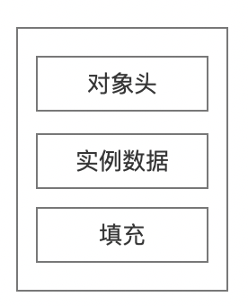
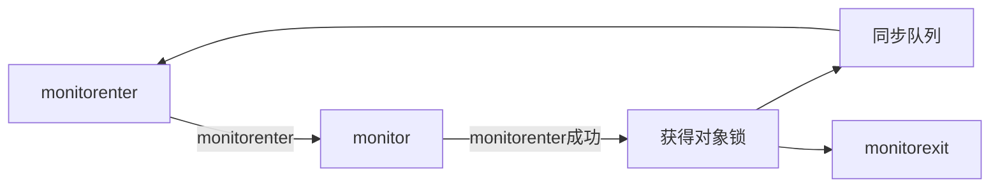
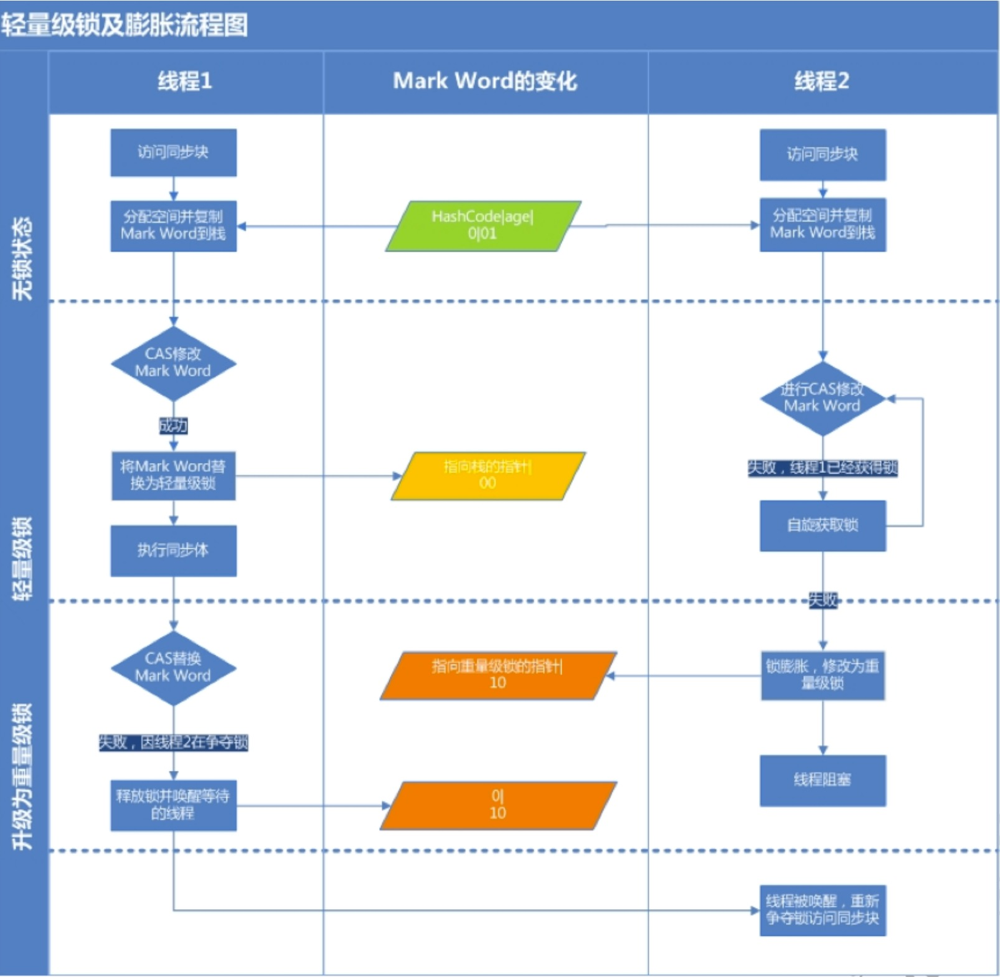

thread-source-study

# 一、对象内存布局

​		在 Hotspot 虚拟机中，对象在内存中的存储布局，可以分 为三个区域:对象头(Header)、实例数据(Instance Data)、对 齐填充(Padding)。

​		

​		对象头记录了对象和锁有关的信息，当某个对象被 synchronized 关键字当成同步锁时，那么围绕这个锁的一 系列操作都和 Mark word 有关系。Mark Word 在 32 位虚 拟机的长度是 32bit、在 64 位虚拟机的长度是 64bit。

<center>32位Mark Word的状态变化</center>

<table width="384.30" border="0" cellpadding="0" cellspacing="0" style='width:384.30pt;border-collapse:collapse;table-layout:fixed;'>
   <col width="151.20" span="2" class="xl65" style='mso-width-source:userset;mso-width-alt:2184;'/>
   <col width="197.45" class="xl65" style='mso-width-source:userset;mso-width-alt:4157;'/>
   <col width="169.95" class="xl65" style='mso-width-source:userset;mso-width-alt:2984;'/>
   <col width="163.30" class="xl65" style='mso-width-source:userset;mso-width-alt:2700;'/>
   <col width="151.20" span="16379" class="xl65" style='mso-width-source:userset;mso-width-alt:2184;'/>
   <tr height="19.10" style='height:19.10pt;mso-height-source:userset;mso-height-alt:382;'>
    <td class="xl66" height="38.20" width="51.20" rowspan="2" style='height:38.20pt;width:51.20pt;border-right:1.0pt solid #EEEEEE;border-bottom:1.5pt solid #DDDDDD;' x:str>锁状态</td>
    <td class="xl67" width="148.65" colspan="2" style='width:148.65pt;border-right:1.0pt solid #EEEEEE;border-bottom:1.5pt solid #DDDDDD;' x:str>25bit</td>
    <td class="xl67" width="69.95" rowspan="2" style='width:69.95pt;border-right:1.0pt solid #EEEEEE;border-bottom:1.5pt solid #DDDDDD;' x:str>4bit</td>
    <td class="xl67" width="63.30" style='width:63.30pt;' x:str>1bit</td>
    <td class="xl76" width="51.20" style='width:51.20pt;' x:str>2bit</td>
   </tr>
   <tr height="19.10" style='height:19.10pt;'>
    <td class="xl69" x:str>23bit</td>
    <td class="xl69" x:str>2bit</td>
    <td class="xl70" x:str>是否偏向锁</td>
    <td class="xl77" x:str>锁标志位</td>
   </tr>
   <tr height="19.10" style='height:19.10pt;'>
    <td class="xl71" height="19.10" style='height:19.10pt;' x:str>无锁</td>
    <td class="xl72" colspan="2" style='border-right:1.0pt solid #EEEEEE;border-bottom:1.0pt solid #DDDDDD;' x:str>对象的hashCode</td>
    <td class="xl74" x:str>对象分代年龄</td>
    <td class="xl74" x:num>0</td>
    <td class="xl78" x:str>01</td>
   </tr>
   <tr height="18.35" style='height:18.35pt;'>
    <td class="xl75" height="18.35" style='height:18.35pt;' x:str>偏向锁</td>
    <td class="xl74" x:str>线程ID</td>
    <td class="xl74" x:str>Epoch</td>
    <td class="xl74" x:str>对象分代年龄</td>
    <td class="xl74" x:num>1</td>
    <td class="xl79" x:str>01</td>
   </tr>
   <tr height="20.60" style='height:20.60pt;mso-height-source:userset;mso-height-alt:412;'>
    <td class="xl75" height="20.60" style='height:20.60pt;' x:str>轻量级锁</td>
    <td class="xl72" colspan="4" style='border-right:1.0pt solid #EEEEEE;border-bottom:1.0pt solid #DDDDDD;' x:str>指向栈中锁记录的指针</td>
    <td class="xl78" x:str>00</td>
   </tr>
   <tr height="19.10" style='height:19.10pt;mso-height-source:userset;mso-height-alt:382;'>
    <td class="xl75" height="19.10" style='height:19.10pt;' x:str>重量级锁</td>
    <td class="xl74" colspan="4" style='border-right:1.0pt solid #EEEEEE;border-bottom:1.0pt solid #DDDDDD;' x:str>指向互斥量(重量级锁)的指针</td>
    <td class="xl79" x:num>10</td>
   </tr>
   <tr height="19.10" style='height:19.10pt;mso-height-source:userset;mso-height-alt:382;'>
    <td class="xl75" height="19.10" style='height:19.10pt;' x:str>GC标记</td>
    <td class="xl72" colspan="4" style='border-right:1.0pt solid #EEEEEE;border-bottom:1.0pt solid #DDDDDD;' x:str>空</td>
    <td class="xl78" x:num>11</td>
   </tr>
  </table>


<center>64位Mark Word的状态变化</center>

 <table width="384.30" border="0" cellpadding="0" cellspacing="0" style='width:579.20pt;border-collapse:collapse;table-layout:fixed;'>
   <col width="151.20" span="2" class="xl65" style='mso-width-source:userset;mso-width-alt:2184;'/>
   <col width="197.45" span="3" class="xl65" style='mso-width-source:userset;mso-width-alt:4157;'/>
   <col width="169.95" class="xl65" style='mso-width-source:userset;mso-width-alt:2984;'/>
   <col width="163.30" class="xl65" style='mso-width-source:userset;mso-width-alt:2700;'/>
   <col width="151.20" span="16377" class="xl65" style='mso-width-source:userset;mso-width-alt:2184;'/>
   <tr height="119.10" class="xl65" style='height:19.10pt;mso-height-source:userset;mso-height-alt:382;'>
    <td class="xl66" height="38.20" width="51.20" rowspan="2" style='height:38.20pt;width:51.20pt;border-right:1.0pt solid #EEEEEE;border-bottom:1.5pt solid #DDDDDD;' x:str>锁状态</td>
    <td class="xl67" width="51.20" rowspan="2" style='width:51.20pt;border-right:1.0pt solid #EEEEEE;border-bottom:none;' x:str>25bit</td>
    <td class="xl67" width="60.45" rowspan="2" style='width:97.45pt;border-right:1.0pt solid #EEEEEE;border-bottom:none;' x:str>29bit</td>
    <td class="xl67" width="60.45" rowspan="2" style='width:97.45pt;border-right:1.0pt solid #EEEEEE;border-bottom:none;' x:str>2bit</td>
    <td class="xl67" width="60.45" rowspan="2" style='width:97.45pt;border-right:1.0pt solid #EEEEEE;border-bottom:none;' x:str>1bit</td>
    <td class="xl74" width="60.95" rowspan="2" style='width:69.95pt;border-right:1.0pt solid #EEEEEE;border-bottom:1.5pt solid #DDDDDD;' x:str>4bit</td>
    <td class="xl74" width="60.30" style='width:63.30pt;' x:str>1bit</td>
    <td class="xl75" width="50.20" style='width:51.20pt;' x:str>2bit</td>
   </tr>
   <tr height="19.10" class="xl65" style='height:19.10pt;'>
    <td class="xl76" x:str>是否偏向锁</td>
    <td class="xl77" x:str>锁标志位</td>
   </tr>
   <tr height="19.10" class="xl65" style='height:19.10pt;'>
    <td class="xl69" height="19.10" style='height:19.10pt;' x:str>无锁</td>
    <td class="xl70" x:str>unused</td>
    <td class="xl71" colspan="2" style='border-right:1.0pt solid #EEEEEE;border-bottom:1.0pt solid #DDDDDD;' x:str>hashCode</td>
    <td class="xl70" x:str>unused</td>
    <td class="xl73" x:str>对象分代年龄</td>
    <td class="xl73" x:num>0</td>
    <td class="xl78" x:str>01</td>
   </tr>
   <tr height="18.35" class="xl65" style='height:18.35pt;'>
    <td class="xl72" height="18.35" style='height:18.35pt;' x:str>偏向锁</td>
    <td class="xl71" colspan="2" style='border-right:1.0pt solid #EEEEEE;border-bottom:1.0pt solid #DDDDDD;' x:str>线程ID</td>
    <td class="xl73" x:str>Epoch</td>
    <td class="xl73" x:str>unused</td>
    <td class="xl73" x:str>对象分代年龄</td>
    <td class="xl73" x:num>1</td>
    <td class="xl79" x:str>01</td>
   </tr>
   <tr height="20.60" class="xl65" style='height:20.60pt;mso-height-source:userset;mso-height-alt:412;'>
    <td class="xl72" height="20.60" style='height:20.60pt;' x:str>轻量级锁</td>
    <td class="xl71" colspan="6" style='border-right:1.0pt solid #EEEEEE;border-bottom:1.0pt solid #DDDDDD;' x:str>指向栈中锁记录的指针</td>
    <td class="xl78" x:str>00</td>
   </tr>
   <tr height="19.10" class="xl65" style='height:19.10pt;mso-height-source:userset;mso-height-alt:382;'>
    <td class="xl72" height="19.10" style='height:19.10pt;' x:str>重量级锁</td>
    <td class="xl73" colspan="6" style='border-right:1.0pt solid #EEEEEE;border-bottom:1.0pt solid #DDDDDD;' x:str>指向互斥量(重量级锁)的指针</td>
    <td class="xl79" x:num>10</td>
   </tr>
   <tr height="19.10" class="xl65" style='height:19.10pt;mso-height-source:userset;mso-height-alt:382;'>
    <td class="xl72" height="19.10" style='height:19.10pt;' x:str>GC标记</td>
    <td class="xl71" colspan="6" style='border-right:1.0pt solid #EEEEEE;border-bottom:1.0pt solid #DDDDDD;' x:str>空</td>
    <td class="xl78" x:num>11</td>
   </tr>
  </table>


**偏向锁**

偏向锁，顾名思义，它会偏向于第一个访问锁的线程，如果在运行过程中，同步锁只有一个线程访问，不存在多线程争用的情况，则线程是不需要触发同步的，这种情况下，就会给线程加一个偏向锁。 如果在运行过程中，遇到了其他线程抢占锁，则持有偏向锁的线程会被挂起，JVM会消除它身上的偏向锁，将锁恢复到标准的轻量级锁。

当线程1第一次访问临界区时，线程ID并未指向当前线程，则通过CAS操作竞争锁。如果竞争成功，则将Mark Word中线程ID设置为当前线程ID，然后执行同步代码块。

当线程1再次访问临界区时，如果为可偏向状态，线程ID是否指向当前线程，如果是，执行同步代码块。

实际上只有 Thread#1 初次进入临界区时需要执行 CAS 操作，以后再出入临界区都不会有同步操作带来的开销。

注意：偏向锁的场景太过于理想化，大多数情况都会关闭偏向锁。

**轻量级锁**

多个线程正常交替执行，当其中一个线程尝试进入临界区， 如果 Thread#2 也进入临界区但是 Thread#1 还没有执行完同步代码块时，会暂停 Thread#1 并且升级到轻量级锁。Thread#2 通过自旋再次尝试以轻量级锁的方式来获取锁。

自旋就是一定条件下的不断循环，目的是为了减少线程切换系统开销。

**重量级锁**

当多个线程同时进入临界区时，轻量级锁就会膨胀为重量级锁，及只有或得锁的线程执行同步代码块，其他线程都会被阻塞。如果 Thread#1 和 Thread#2 正常交替执行，那么轻量级锁基本能够满足锁的需求。但是如果 Thread#1 和 Thread#2 同时进入临界区，那么轻量级锁就会膨胀为重量级锁，意味着Thread#1线程获得了重量级锁的情况下，Thread#2就会被阻塞。

重量级锁的monitor

加了同步代码块以后，在字节码中会看到一个 monitorenter 和 monitorexit。
 每一个 JAVA 对象都会与一个监视器 monitor 关联，我们 可以把它理解成为一把锁，当一个线程想要执行一段被 synchronized 修饰的同步方法或者代码块时，该线程得先 获取到 synchronized 修饰的对象对应的 monitor。 monitorenter 表示去获得一个对象监视器。monitorexit 表 示释放 monitor 监视器的所有权，使得其他被阻塞的线程 可以尝试去获得这个监视器

monitor 依赖操作系统的 MutexLock(互斥锁)来实现的, 线 程被阻塞后便进入内核(Linux)调度状态，这个会导致系 统在用户态与内核态之间来回切换，严重影响锁的性能

通过javap -v xxx.class工具查看生成的class文件信息,分析synchronized关键字的实现细节

```html
    public void demo(){
        synchronized (this){ //同步代码块

        }
    }

javap -v Demo.class
  //同步代码块方法
  public void demo();
    descriptor: ()V
    flags: (0x0001) ACC_PUBLIC
    Code:
      stack=2, locals=3, args_size=1
         0: aload_0
         1: dup
         2: astore_1
         3: monitorenter   //重点
         4: aload_1
         5: monitorexit    //重点
         6: goto          14
         9: astore_2
        10: aload_1
        11: monitorexit   //重点
        12: aload_2
        13: athrow
        14: return
      Exception table:
         from    to  target type
             4     6     9   any
             9    12     9   any
      LineNumberTable:
        line 18: 0
        line 20: 4
        line 21: 14
      LocalVariableTable:
        Start  Length  Slot  Name   Signature
            0      15     0  this   Lcom/gupaoedu/vip/SyncDemo;
      StackMapTable: number_of_entries = 2
        frame_type = 255 /* full_frame */
          offset_delta = 9
          locals = [ class com/gupaoedu/vip/SyncDemo, class java/lang/Object ]
          stack = [ class java/lang/Throwable ]
        frame_type = 250 /* chop */
          offset_delta = 4
        
```

在 Hotspot 中，markOop的定义在markOop.hpp文件中，部分源码如下:

```java
	//获取对象监视器  
	bool has_monitor() const {
    return ((value() & monitor_value) != 0);
  }
	//ObjectMonitor是实现重量级锁核心
  ObjectMonitor* monitor() const {
    assert(has_monitor(), "check");
    // Use xor instead of &~ to provide one extra tag-bit check.
    return (ObjectMonitor*) (value() ^ monitor_value);
  }
```

重量级锁实现过程



总结

在所有的锁都启用的情况下线程进入临界区时会先去获取偏向锁，如果已经存在偏向锁了，则会尝试获取轻量级锁，启用自旋锁，如果自旋也没有获取到锁，则使用重量级锁，没有获取到锁的线程阻塞挂起，直到持有锁的线程执行完同步块唤醒他们；

偏向锁是在无锁争用的情况下使用的，也就是同步开在当前线程没有执行完之前，没有其它线程会执行该同步块，一旦有了第二个线程的争用，偏向锁就会升级为轻量级锁，如果轻量级锁自旋到达阈值后，没有获取到锁，就会升级为重量级锁；

如果线程争用激烈，那么应该禁用偏向锁。


轻量级锁及膨胀流程		


自旋必须要有一定的条件控制，否则如果一个线程执行同步代码块的时间很长，那么这个线程不断的循环反而会消耗CPU资源。默认情况下自旋的次数是10次， 可以通过 preBlockSpin 来修改 。

在 JDK1.6 之后，引入了自适应自旋锁，自适应意味着自旋 的次数不是固定不变的，而是根据前一次在同一个锁上自 旋的时间以及锁的拥有者的状态来决定。 如果在同一个锁对象上，自旋等待刚刚成功获得过锁，并 且持有锁的线程正在运行中，那么虚拟机就会认为这次自 旋也是很有可能再次成功，进而它将允许自旋等待持续相 对更长的时间。如果对于某个锁，自旋很少成功获得过， 那在以后尝试获取这个锁时将可能省略掉自旋过程，直接 阻塞线程，避免浪费处理器资源。